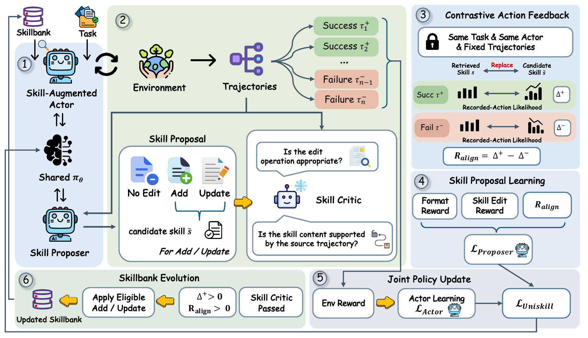

# UniSkill: Learning Actor-Aligned Skill Proposals for an Evolving Policy

<p align="center">
  <a href="https://arxiv.org/abs/2610.10164"></a>
  <a href="https://github.com/LimOkii/UniSKill"></a>
</p>

UniSkill jointly trains a skill-augmented actor and a skill proposer with a shared language model. The proposer compares successful and failed task trajectories, proposes **No Edit**, **Add**, or **Update**, and receives actor-alignment feedback from recorded action likelihoods rather than new evaluation rollouts for each proposal. A skill critic filters unsupported edits before they enter the skillbank.



The paper reports the following main-experiment results with Qwen2.5-7B-Instruct (mean ± standard deviation over three independent training runs):

| Benchmark | Metric | UniSkill |
| --- | --- | ---: |
| ALFWorld | Success | **98.4 ± 0.8%** |
| WebShop | Task Score | **90.5 ± 1.4** |
| WebShop | Success | **84.7 ± 0.5%** |

## Install environments

We strongly recommend running ALFWorld and WebShop in separate Conda environments.

Run these commands from the repository root. Installation follows [verl-agent](https://github.com/langfengq/verl-agent#installation); the WebShop PyTorch command assumes CUDA 12.4.

### ALFWorld

```bash
conda create -n uniskill-alfworld python=3.12 -y
conda activate uniskill-alfworld
pip install vllm==0.11.0
pip install flash-attn==2.7.4.post1 --no-build-isolation --no-cache-dir
pip install -e .
pip install gymnasium==0.29.1 stable-baselines3==2.6.0
pip install alfworld
alfworld-download -f
```

### WebShop

```bash
conda create -n uniskill-webshop python=3.10 -y
conda activate uniskill-webshop
cd agent_system/environments/env_package/webshop/webshop
bash setup.sh -d all
cd ../../../../../
pip install torch==2.6.0 --index-url https://download.pytorch.org/whl/cu124
pip install flash-attn==2.7.4.post1 --no-build-isolation
pip install -e .
pip install vllm==0.8.5
```

If `gdown` fails, see the [WebShop installation notes](https://github.com/langfengq/verl-agent#2-webshop). Set `JAVA_HOME` below; set `JVM_PATH` only if `libjvm.so` is outside `$JAVA_HOME/lib/server/`.

## Configure training

Fill in [`scripts/config.yaml`](scripts/config.yaml) before training:

| Field | What to provide |
| --- | --- |
| `MODEL_PATH` | Local Qwen2.5-7B-Instruct directory or compatible model identifier |
| `EMBEDDING_MODEL_PATH` | Local Qwen3-Embedding-0.6B directory or compatible model identifier |
| `UNISKILL_CRITIC_API_URL` | Full chat completions URL, such as `https://api.example.com/v1/chat/completions` |
| `UNISKILL_CRITIC_MODEL` | Model name served by that endpoint; defaults to `DeepSeek-V4-Pro` |
| `UNISKILL_CRITIC_API_KEY` | API key for the critic endpoint |
| `JAVA_HOME` | JVM installation directory for WebShop; leave empty for ALFWorld |

## Train

### ALFWorld

```bash
RUN_NAME=alfworld_seed0 bash scripts/train_alfworld.sh
```

### WebShop

```bash
RUN_NAME=webshop_seed0 bash scripts/train_webshop.sh
```

Use a different `RUN_NAME` for each run.

## Outputs

Run artifacts are stored under `uniskill/artifacts/`. Keep each checkpoint with its matching skillbank snapshot.

## Acknowledgments

UniSkill builds on [verl](https://github.com/verl-project/verl) and [verl-agent](https://github.com/langfengq/verl-agent). We thank their authors and contributors for making these frameworks available.

## Citation

If you find our work useful, please consider giving us a ⭐ and citing our paper:

```bibtex
@misc{lu2026uniskilllearningactoralignedskill,
  title={UniSkill: Learning Actor-Aligned Skill Proposals for an Evolving Policy},
  author={Yifei Lu and Cheng Liu and Dianzhi Yu and Hui Xiang and Ji Zhang and Yuanchu Xiao and Rong Liang},
  year={2026},
  eprint={2610.10164},
  archivePrefix={arXiv},
  primaryClass={cs.AI},
  url={https://arxiv.org/abs/2610.10164},
}
```
